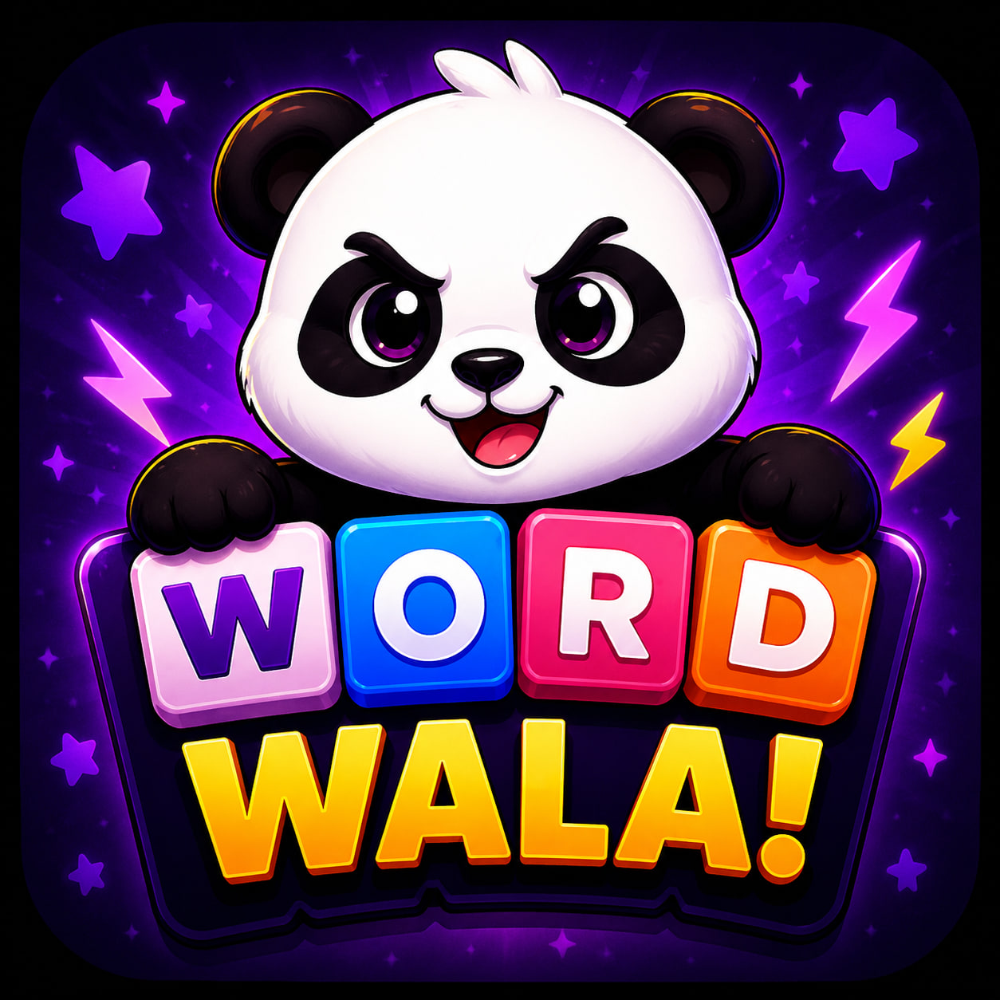

<div align="center">



# Word Wala — Web

**The middleware between the internet and the [Word Wala Android game](https://play.google.com/store/apps/details?id=com.wordwala.game.word_wala).**

Live at **[wordwala.in](https://wordwala.in)** · App live on Google Play with **50+ downloads**

[](https://nextjs.org)
[](https://react.dev)
[](https://www.typescriptlang.org)
[](https://tailwindcss.com)
[](https://vercel.com)

</div>

---

## What this repo is

This is **not** the game. The real Word Wala is a native Android app shipping on the Google Play Store.

This repo is the **middleware layer that sits in front of it** — the piece that turns a random web visitor into an installed player:

```
   Google / Instagram / word-of-mouth
                 │
                 ▼
      ┌──────────────────────┐
      │   wordwala.in        │   ← this repo
      │   (Next.js 16)       │
      │                      │
      │  • SEO landing pages │
      │  • In-browser demo   │
      │  • Vocabulary blog   │
      │  • Contact / support │
      └──────────┬───────────┘
                 │  deep link
                 ▼
   ┌───────────────────────────────┐
   │  Word Wala on Google Play     │   ← the actual product
   │  com.wordwala.game.word_wala  │      50+ downloads
   └───────────────────────────────┘
```

The site does three jobs:

1. **Discovery** — SEO-tuned pages so people searching for word games find Word Wala instead of the app store's algorithm deciding for them.
2. **Try before install** — a fully playable browser version of the core loop (`/play`) so visitors experience the game *before* committing to a download.
3. **Conversion** — every page routes to the Play Store listing via a persistent header CTA, a sticky launch banner, and a dedicated download section.

> It's a front-of-funnel bridge, not a backend service — the site holds no game state and talks to no private API. Everything the demo needs runs client-side.

---

## Tech stack

| Layer | What's used | Why |
|---|---|---|
| **Framework** | [Next.js 16.2.6](https://nextjs.org) — App Router | File-based routing, React Server Components, static generation by default |
| **Bundler** | Turbopack (configured in [next.config.ts](next.config.ts)) | Fast dev refresh on a 2,700-line codebase |
| **UI** | [React 19.2.4](https://react.dev) | Server Components for content pages, Client Components only where interactivity demands it |
| **Language** | [TypeScript 5](https://www.typescriptlang.org) (strict) | Fully typed game state, dictionary responses, and blog schema |
| **Styling** | [Tailwind CSS v4](https://tailwindcss.com) via `@tailwindcss/postcss` | Utility-first, zero runtime CSS-in-JS |
| **Fonts** | `next/font/google` — Nunito (400–900) | Self-hosted at build time, no layout shift, no external font request |
| **Analytics** | [`@vercel/analytics`](https://vercel.com/analytics) | Privacy-friendly page + conversion tracking |
| **Linting** | ESLint 9 + `eslint-config-next` (flat config) | [eslint.config.mjs](eslint.config.mjs) |
| **Hosting** | [Vercel](https://vercel.com) | Edge CDN, preview deploys per push |

### External data sources

| Service | Role |
|---|---|
| [Free Dictionary API](https://dictionaryapi.dev) | Primary source for definitions, phonetics, examples, synonyms |
| [Wiktionary REST API](https://en.wiktionary.org/api/rest_v1/) | Automatic fallback when the primary returns 404 or fails |
| `public/words_dictionary.json` | ~2.2 MB local word list (**125,000+ entries**) — validates words offline, zero latency, zero API cost |

---

## What's inside

```
app/
  layout.tsx            Root layout — fonts, SEO metadata, header/footer/banner, analytics
  page.tsx              Landing page — hero, USP, game modes, how-it-works, stats, CTA
  play/page.tsx         Quick Play — the in-browser demo
  features/page.tsx     Full feature breakdown
  blog/page.tsx         Blog index
  blog/[slug]/page.tsx  Static blog posts (generateStaticParams)
  about/page.tsx        Story + values
  contact/page.tsx      Support & feedback
components/
  QuickPlay.tsx         The playable game engine (~950 lines)
  HeroGrid.tsx          Animated letter-grid hero
  LearnShowcase.tsx     "Every word teaches you something" demo
  StealShowcase.tsx     Steal-mechanic explainer
  WordMeaningCard.tsx   Definition card with live dictionary lookup
  LaunchBanner.tsx      Dismissible sticky download banner
  Header.tsx / Footer.tsx
lib/
  dictionary.ts         Dictionary client — dual-source, cached, request-coalesced
  posts.ts              Typed blog content store
public/
  words_dictionary.json 125K+ word validation set
  logo.png
```

---

## Notable implementation details

**A real game engine in the browser** — [components/QuickPlay.tsx](components/QuickPlay.tsx) isn't a video or a mockup. It runs an 8×8 shared grid, scans all four axes (horizontal, vertical, both diagonals) for every valid unclaimed 3–10 letter word after each move, handles pointer *and* touch tracing for swipe input, and plays an AI opponent that picks its own words. First to 75 points wins — the same loop as the Android app.

**Dictionary lookups that don't hammer the API** — [lib/dictionary.ts](lib/dictionary.ts) layers three protections: a `sessionStorage` cache (with a distinct sentinel so "no such word" is cached too, not re-fetched forever), an in-flight `Map` that coalesces simultaneous lookups of the same word into one request, and a 6-second `AbortSignal.timeout` so a hanging request never freezes the UI. Network errors are deliberately *not* cached, so a flaky connection doesn't poison the session.

**Graceful source degradation** — if the Free Dictionary API 404s, the same call transparently retries against Wiktionary's REST endpoint and strips its HTML markup before rendering. The `WordMeaning` type records which source answered.

**SEO built for a game nobody's searched for yet** — the Metadata API drives per-route titles/descriptions, keyword sets, Open Graph, and Twitter cards, all pointing back at the canonical `wordwala.in` and the Play Store listing.

**No backend, on purpose** — the contact form composes a `mailto:` link client-side. Zero servers to run, zero data stored, zero cost.

---

## Running locally

```bash
git clone https://github.com/Abhish0/wordwala-website.git
cd wordwala-website
npm install
npm run dev
```

Open [http://localhost:3000](http://localhost:3000).

| Script | Does |
|---|---|
| `npm run dev` | Dev server with Turbopack |
| `npm run build` | Production build |
| `npm start` | Serve the production build |
| `npm run lint` | ESLint |

No environment variables required — every data source is either public or bundled.

---

## The game itself

**Word Wala** is a multiplayer word-building game for Android:

- 🎯 **Trace to score** — place a letter on the shared grid, then swipe across connecting letters to claim a word. Longer words, bigger points.
- 📖 **Learn as you play** — every word you claim comes back with its meaning, pronunciation, and an example sentence. Your personal dictionary grows every match.
- ⚡ **Steal mechanic** — extend an opponent's word and take the points for yourself.
- 👥 **Three modes** — Pass & Play (2–4 players, one device), Online multiplayer, and a solo AI opponent.

<div align="center">

### [⬇️ Download on Google Play](https://play.google.com/store/apps/details?id=com.wordwala.game.word_wala)

Made in India 🇮🇳 · Daily word drops on Instagram [@WordWalaApp](https://instagram.com/WordWalaApp)

</div>
